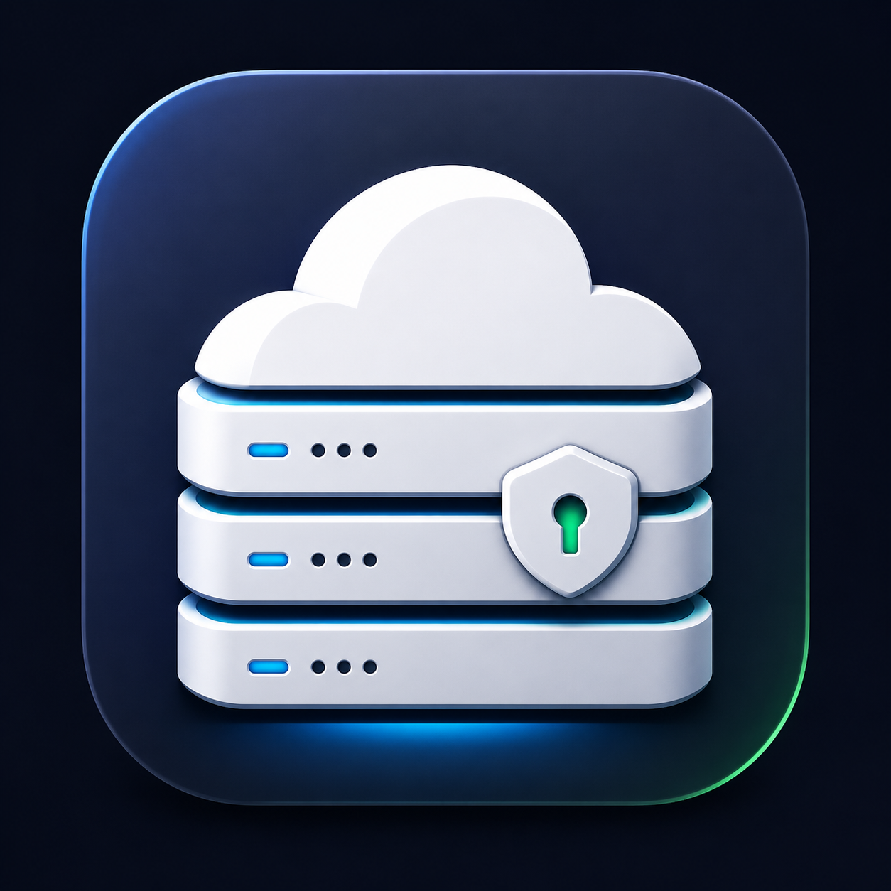

# LocalCloud Stack

<p align="center">
  
</p>

<p align="center">
  
  
  
</p>

LocalCloud Stack is a self-hosted home/server stack for people who want private services on their own hardware without opening a broad public attack surface. It uses rootless Podman, Cloudflare Tunnel, LAN-only DNS, encrypted backups, and opt-in management/chat profiles.

This is not a hosted SaaS product. It is installable self-hosted software: users run it on their own Ubuntu Server machine with `./install.sh`.

## What It Includes

| Service | Purpose | Default Exposure |
|---|---|---|
| cloudflared | Cloudflare Tunnel gateway | outbound-only |
| Glances | lightweight host monitoring | Cloudflare Tunnel, protect with Access |
| Gitea | self-hosted Git | Cloudflare Tunnel for HTTP, LAN-bound SSH |
| n8n | workflow automation | Cloudflare Tunnel, protect UI with Access |
| restic backup sidecar | encrypted, versioned backups | no network |

Optional profiles (enable by setting `LOCALCLOUD_PROFILES` in `.env`, comma-separated, e.g. `LOCALCLOUD_PROFILES=dns,chat`):

| Profile | Services | Default |
|---|---|---|
| `dns` | AdGuard Home — LAN DNS + ad-blocking. The installer reconfigures the host resolver (`/etc/resolv.conf`, systemd-resolved, port 53). | off |
| `mgmt` | Portainer | off |
| `chat` | Mattermost + Postgres | off |

## Requirements

- Ubuntu Server
- Podman and podman-compose
- Cloudflare account and Tunnel token
- Static LAN IP for the server
- USB or external disk for backups

## Install

```sh
git clone https://github.com/bolatbaris/homelab.git localcloud-stack
cd localcloud-stack
./install.sh
```

The first run creates `.env` and stops. Edit `.env`, then run:

```sh
./install.sh
```

Minimum required `.env` values:

- `TUNNEL_TOKEN`
- `LAN_IP`
- `BASE_DOMAIN`
- `N8N_ENCRYPTION_KEY`
- `RESTIC_PASSWORD`
- `BACKUP_DEST_PATH`

Enable optional services with `LOCALCLOUD_PROFILES` (e.g. `LOCALCLOUD_PROFILES=dns,chat`). `PODMAN_SOCKET_PATH` is required only for the `mgmt` profile (Portainer); `MATTERMOST_DB_PASSWORD` only for the `chat` profile.

Generate secrets:

```sh
openssl rand -hex 32      # N8N_ENCRYPTION_KEY
openssl rand -base64 48   # RESTIC_PASSWORD
```

## Development

Use the explicit dev compose file. It binds dev ports to `127.0.0.1` only.

```sh
podman-compose -f docker-compose.yml -f compose.dev.yml up -d
```

Optional Portainer:

```sh
podman-compose -f docker-compose.yml -f compose.dev.yml --profile mgmt up -d
```

Optional Mattermost:

```sh
podman-compose -f docker-compose.yml -f compose.dev.yml --profile chat up -d
```

## Security Model

- Web services are intended to be exposed through Cloudflare Tunnel.
- Admin-style apps should be protected by Cloudflare Access and MFA.
- Portainer is opt-in because it controls the Podman API socket.
- Mattermost is opt-in because it adds public attack surface and a database sidecar.
- Backups are encrypted restic snapshots, not plain folder mirrors.
- `docker-compose.override.yml` is ignored because Compose auto-loads it.

See [SECURITY.md](SECURITY.md) for the deployment baseline.

## Backups And Restore

The backup container runs nightly at `03:00` in the configured `TZ`, initializes an encrypted restic repository under `${BACKUP_DEST_PATH}/restic-repo`, and keeps daily, weekly, and monthly snapshots according to `.env`.

Keep `RESTIC_PASSWORD` and `N8N_ENCRYPTION_KEY` **off** the backup disk (for example in a password manager). Without them a restored backup cannot be decrypted.

Restore the latest snapshot and bring the stack back up:

```sh
./restore.sh            # latest snapshot
./restore.sh <id>       # a specific snapshot from `restic snapshots`
```

`restore.sh` restores through Podman's user namespace so file ownership matches what the rootless containers expect, and moves your current `./data/<svc>` aside (`*.pre-restore-*`) instead of deleting it. See [deployment.md](deployment.md) for the full disaster-recovery walkthrough.

## Documentation

- [Deployment Runbook](deployment.md)
- [Architecture](architecture.md)
- [Security Baseline](SECURITY.md)
- [Contributing](CONTRIBUTING.md)
- [Changelog](CHANGELOG.md)

## License

MIT. See [LICENSE](LICENSE).
