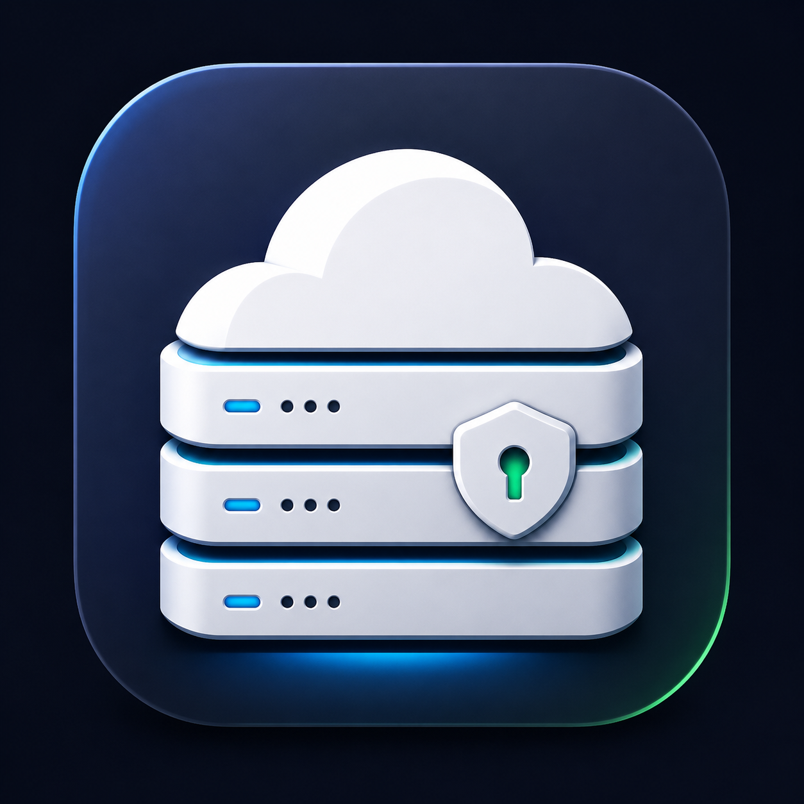

# LocalCloud Stack

<p align="center">
  
</p>

<p align="center">
  
  
  
</p>

LocalCloud Stack is a self-hosted home/server stack for people who want private services on their own hardware without opening a broad public attack surface. It uses rootless Podman, Cloudflare Tunnel, LAN-only DNS, encrypted backups, and opt-in management/chat profiles.

This is not a hosted SaaS product. It is installable self-hosted software: users run it on their own Ubuntu Server machine with `./install.sh`.

## What It Includes

| Service | Purpose | Default Exposure |
|---|---|---|
| cloudflared | Cloudflare Tunnel gateway | outbound-only |
| Glances | lightweight host monitoring | Cloudflare Tunnel, protect with Access |
| Gitea | self-hosted Git | Cloudflare Tunnel for HTTP, LAN-bound SSH |
| n8n | workflow automation | Cloudflare Tunnel, protect UI with Access |
| restic backup sidecar | encrypted, versioned backups | no network |
| PostgreSQL + Adminer (`db` profile) | application database for your own backends | Tailscale only, never Cloudflare |
| Umami (`analytics` profile) | privacy-first web analytics | Tailscale only, never Cloudflare |
| GlitchTip (`monitoring` profile) | Sentry-compatible error monitoring for your apps | Tailscale only, never Cloudflare |

Optional profiles (enable by setting `LOCALCLOUD_PROFILES` in `.env`, comma-separated, e.g. `LOCALCLOUD_PROFILES=dns,chat`):

| Profile | Services | Default |
|---|---|---|
| `dns` | AdGuard Home - LAN DNS + ad-blocking. The installer reconfigures the host resolver (`/etc/resolv.conf`, systemd-resolved, port 53). | off |
| `mgmt` | Portainer | off |
| `chat` | Mattermost + Postgres + logical chat-history dumps | off |
| `env` | Infisical - encrypted env/secret store for projects (dev/test/qa/prod). Tier B only: reachable through Tailscale, never through the tunnel; requires `TAILSCALE_ENABLED=true`. | off |
| `db` | PostgreSQL + Adminer + logical dumps - the Private (Tier B) application database. Requires `TAILSCALE_ENABLED=true`; the installer refuses the profile without it. | off |
| `analytics` | Umami - privacy-first web analytics + PostgreSQL + logical dumps. Tier B only: reachable through Tailscale, never through the tunnel; requires `TAILSCALE_ENABLED=true`. | off |
| `monitoring` | GlitchTip - Sentry-compatible app-error monitoring + PostgreSQL + Valkey + logical dumps. Tier B only: reachable through Tailscale, never through the tunnel; requires `TAILSCALE_ENABLED=true`. | off |

## Requirements

- Ubuntu Server
- Podman and podman-compose (>= 1.1.0 when using `LOCALCLOUD_PROFILES`; older builds have no `--profile` flag)
- Cloudflare account and Tunnel token
- Static LAN IP for the server
- USB or external disk for backups
- Optional: Tailscale on the host for the Private (Tier B) transport - **required** if you enable the `db`, `env`, `analytics`, or `monitoring` profile

## Install

```sh
git clone https://github.com/bolatbaris/homelab.git localcloud-stack
cd localcloud-stack
./install.sh
```

The first run creates `.env` and stops. Edit `.env`, then run:

```sh
./install.sh
```

Minimum required `.env` values:

- `TUNNEL_TOKEN`
- `LAN_IP`
- `BASE_DOMAIN`
- `N8N_ENCRYPTION_KEY`
- `RESTIC_PASSWORD`
- `BACKUP_DEST_PATH`

Enable the Private (Tier B) transport with `TAILSCALE_ENABLED=true` after installing Tailscale on the host (see [deployment.md section 13](deployment.md)); `install.sh` detects the tailscale0 address and writes it to `TAILSCALE_IP`.

Enable optional services with `LOCALCLOUD_PROFILES` (e.g. `LOCALCLOUD_PROFILES=dns,chat`). Valid values are `dns`, `mgmt`, `chat`, `env`, `db`, `analytics`, and `monitoring`; invalid values fail the installer. `PODMAN_SOCKET_PATH` is required only for the `mgmt` profile (Portainer); `MATTERMOST_DB_PASSWORD` and `MATTERMOST_SUBDOMAIN` are required only for the `chat` profile.

The `db` profile additionally requires `TAILSCALE_ENABLED=true` plus `APPDB_SUPERUSER_PASSWORD`, `APPDB_APP_USER`, `APPDB_APP_PASSWORD`, and `APPDB_DATABASES`. It publishes PostgreSQL and Adminer on the tailscale0 address only, and neither is ever routed through Cloudflare Tunnel. See [deployment.md section 14](deployment.md).

The `env` profile additionally requires `TAILSCALE_ENABLED=true` plus `INFISICAL_ENCRYPTION_KEY`, `INFISICAL_AUTH_SECRET`, and `INFISICAL_DB_PASSWORD`. It publishes Infisical on the tailscale0 address only, and it is never routed through Cloudflare Tunnel. See [deployment.md section 15](deployment.md).

The `analytics` profile additionally requires `TAILSCALE_ENABLED=true` plus `UMAMI_DB_PASSWORD`, `UMAMI_APP_SECRET`, and `UMAMI_2FA_KEY`. It publishes Umami on the tailscale0 address only, and it is never routed through Cloudflare Tunnel. Note that this also applies to Umami's collect endpoint: only tailnet devices can be measured. See [deployment.md section 16](deployment.md).

The `monitoring` profile additionally requires `TAILSCALE_ENABLED=true` plus `GLITCHTIP_SECRET_KEY` and `GLITCHTIP_DB_PASSWORD`. It publishes GlitchTip on the tailscale0 address only, and it is never routed through Cloudflare Tunnel. Note that this also applies to GlitchTip's event-ingest endpoints (DSN / OTLP): only tailnet devices and first-party containers can report events. See [deployment.md section 17](deployment.md).

Generate secrets:

```sh
openssl rand -hex 32      # N8N_ENCRYPTION_KEY
openssl rand -base64 48   # RESTIC_PASSWORD
```

## Development

Use the explicit dev compose file. It binds dev ports to `127.0.0.1` only.

```sh
podman-compose -f docker-compose.yml -f compose.dev.yml up -d
```

Optional Portainer:

```sh
podman-compose -f docker-compose.yml -f compose.dev.yml --profile mgmt up -d
```

Optional Mattermost:

```sh
podman-compose -f docker-compose.yml -f compose.dev.yml --profile chat up -d
```

Optional Umami (dev note: `UMAMI_PORT` defaults to 3002 because Gitea's dev port is `127.0.0.1:3000`):

```sh
podman-compose -f docker-compose.yml -f compose.dev.yml --profile analytics up -d
```

Optional GlitchTip (dev note: `GLITCHTIP_PORT` defaults to 8082, after Infisical's 8080 and Adminer's 8081):

```sh
podman-compose -f docker-compose.yml -f compose.dev.yml --profile monitoring up -d
```

## Security Model

Services follow a three-tier exposure model:

- **Public (Tier A)** - published through Cloudflare Tunnel under per-hostname Cloudflare Access policies.
- **Private (Tier B)** - reachable only through Tailscale; services bind to the tailscale0 address, never to all interfaces. The `db` profile's PostgreSQL and Adminer, the `env` profile's Infisical, and the `analytics` profile's Umami live in this tier.
- **Internal (Tier C)** - never published; loopback or internal compose networks only, reached via SSH.

Additional rules:

- Admin-style apps should be protected by Cloudflare Access and MFA.
- Portainer is opt-in because it controls the Podman API socket.
- Mattermost is opt-in because it adds public attack surface and a database sidecar.
- Backups are encrypted restic snapshots, not plain folder mirrors.
- `docker-compose.override.yml` is ignored because Compose auto-loads it.

See [SECURITY.md](SECURITY.md) for the exposure-tier policy and [docs/tailscale.md](docs/tailscale.md) for the Private tier plan.

## Backups And Restore

The backup container runs nightly at `03:00` in the configured `TZ`, initializes an encrypted restic repository under `${BACKUP_DEST_PATH}/restic-repo`, and keeps daily, weekly, and monthly snapshots according to `.env`.

When `BACKUP_REQUIRE_MOUNT=true`, `./install.sh` fails unless `${BACKUP_DEST_PATH}` is already mounted. The installer writes a marker file on the mounted backup disk, and scheduled backups abort if that marker is missing.

When the `chat` profile is enabled, `mattermost-postgres-dump` writes a logical PostgreSQL dump to `./data/mattermost/db-dumps` at `02:45` by default, before the restic snapshot. That dump contains Mattermost message history in a restore-friendly format; restic also backs up the raw PostgreSQL data directory. The `analytics` profile follows the same pattern: `umami-db-dump` writes its logical dump at `02:00`, and the `monitoring` profile's `glitchtip-db-dump` starts the nightly sequence at `01:45`.

Keep `RESTIC_PASSWORD`, `N8N_ENCRYPTION_KEY`, and `INFISICAL_ENCRYPTION_KEY` **off** the backup disk (for example in a password manager). Without them a restored backup cannot be decrypted.

Restore the latest snapshot and bring the stack back up:

```sh
./restore.sh            # latest snapshot
./restore.sh <id>       # a specific snapshot from `restic snapshots`
```

A backup disk mounted by hand does not come back after a power cut, and the nightly backup then aborts until someone notices. `./backup-automount.sh --device /dev/sdc1` makes it mount at boot - `fstab` for a plain disk, plus a keyfile and `crypttab` for a LUKS one; `--rollback` undoes it. `install.sh` never runs it, because editing `/etc/fstab` and adding a LUKS key slot are host-level decisions - see [deployment.md section 12](deployment.md).

`restore.sh` restores through Podman's user namespace so file ownership matches what the rootless containers expect, uses the profiles configured in `.env`, and moves your current `./data/<svc>` aside (`*.pre-restore-*`) instead of deleting it. See [deployment.md](deployment.md) for the full disaster-recovery walkthrough.

## Documentation

- [Deployment Runbook](deployment.md) - install, restore, wedged-stack recovery, power-loss checklist, and the Private tier
- [Architecture](architecture.md)
- [Security Baseline](SECURITY.md)
- [Contributing](CONTRIBUTING.md)
- [Changelog](CHANGELOG.md)

## License

MIT. See [LICENSE](LICENSE).
